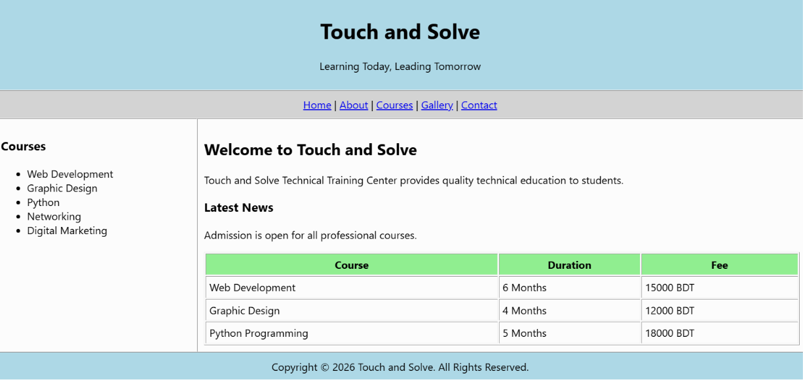

# HTML Assignment: Educational Website Using Tables

## 📌 Objective

Create a simple educational website using **HTML only**. This assignment is designed to help you practice basic HTML tags and page layout using tables.

---

## 📖 Instructions

### General Rules

- Use **HTML only**.
- Do **NOT** use:
  - CSS (Inline, Internal, or External)
  - JavaScript
  - Bootstrap
- Build the **entire webpage layout using `<table>` tags**.
- Write clean, properly indented HTML code.

---

## 🏗️ Website Structure

Your website should contain the following sections:

### 1. Header
- Website Name: **Any Educational Institute Name**
- Slogan: **Learning Today, Leading Tomorrow**

---

### 2. Navigation Menu

Create the following navigation links:

- Home
- About
- Courses
- Gallery
- Contact

---

### 3. Main Content

Divide the page into **two columns**.

#### Left Sidebar (25%)

Create a **Courses** section containing:

- Web Development
- Graphic Design
- Python
- Networking
- Digital Marketing

---

#### Right Content (75%)

Include the following:

### Welcome Section

Heading:
- Welcome to Touch and Solve

Paragraph:
- A short description about the institute.

---

### Latest News

Heading:
- Latest News

Paragraph:
- Admission is open for all professional courses.

---

### Course Information Table

| Course | Duration | Fee |
|---------|----------|-------------|
| Web Development | 6 Months | 15000 BDT |
| Graphic Design | 4 Months | 12000 BDT |
| Python Programming | 5 Months | 18000 BDT |

---

### 4. Footer

Display the following text:

Copyright © 2026 Touch and Solve. All Rights Reserved.

---

## 🛠 Required HTML Tags

Your solution should use the following HTML tags where appropriate:

- `<html>`
- `<head>`
- `<title>`
- `<body>`
- `<table>`
- `<tr>`
- `<td>`
- `<th>`
- `<h1>`
- `<h2>`
- `<h3>`
- `<p>`
- `<a>`
- `<ul>`
- `<li>`

---

## 📋 Requirements

- Use one **main table** for the webpage layout.
- Use a **nested table** for the course information.
- Use **colspan** where necessary.
- Use appropriate table attributes:
  - `border`
  - `width`
  - `cellpadding`
  - `cellspacing`
  - `align`
  - `valign`
- All hyperlinks should use the `<a>` tag.
- Ensure all HTML tags are properly opened and closed.

---

## 📂 Submission

Submit only **one HTML file**.

### File Name Format

```
Student_Name.html
```

Example:

```
Rahim.html
```

---

## 📊 Demo



## 💡 Hint

- Use **nested tables** to organize different sections.
- Use **colspan** to make the Header, Navigation Bar, and Footer span across the full page.
- Maintain proper indentation for better readability.

---

## 🎯 Learning Outcomes

After completing this assignment, students will be able to:

- Create a complete HTML document.
- Design webpage layouts using HTML tables.
- Create hyperlinks and lists.
- Build nested tables.
- Organize webpage content using headings and paragraphs.
- Write clean and well-structured HTML code.